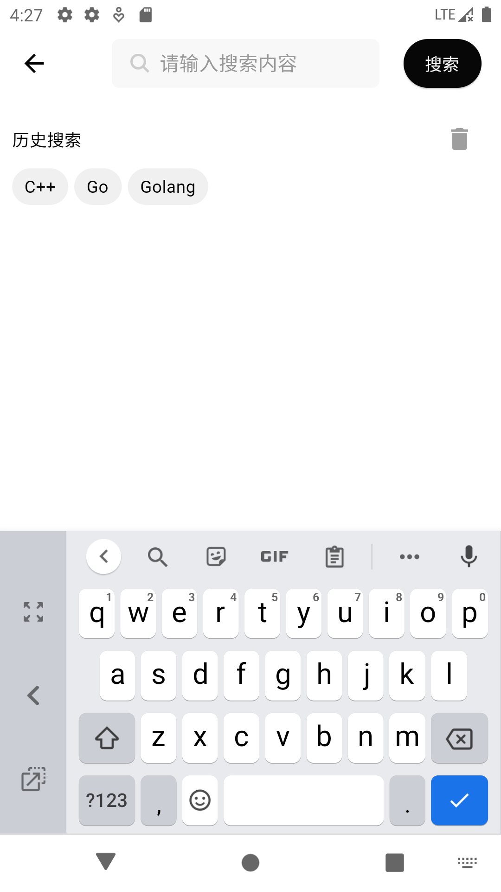

# Mobile-Bookstore
E-Bookstore, mobile!

# Languages
<code></code> for frontend

<code></code> for backend

## Overview

  

    
    
Login Page

  

  

    
    
Register Page

  

  

    
    
Home Page

  

  

    
    
Search Result

  

  

    
    
Search History

  

      

    
    
Browse Book

  

  

    
    
Comment

  

  

    
    
Shopping Cart

  

  

    
    
Address Management

  

